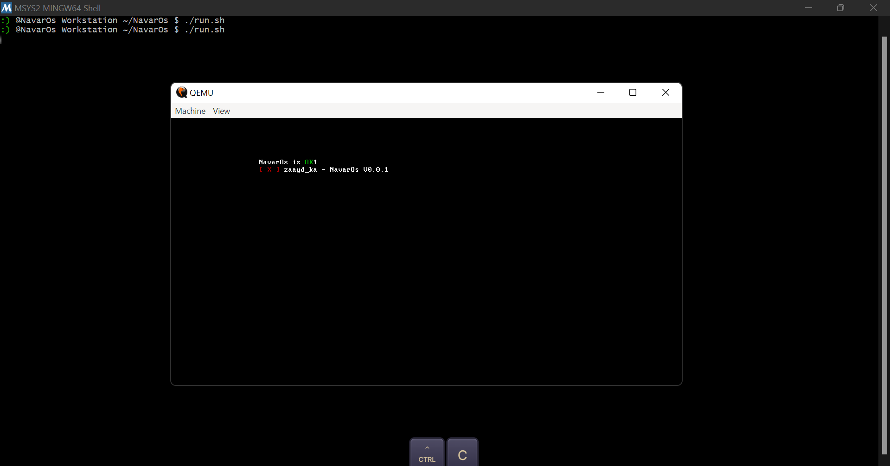

# NavarOs

A simple x86 operating system built from scratch using Assembly and C++.


---

## Overview

NavarOs is a hobby operating system built from scratch. It boots into 32-bit protected mode using a custom bootloader written in x86 Assembly, then hands control to a C++ kernel that provides basic OS functionality.

---

## Features

- [x] 16-bit real mode to 32-bit protected mode switch
- [x] GDT (Global Descriptor Table)
- [x] Kernel written in C++
- [x] VGA text mode driver
  - [x] print_string
  - [x] print_char
  - [x] print_int
  - [x] print_hex
  - [x] set_color
  - [x] clear_screen
  - [x] new_line
  - [x] scroll
  - [x] hide_cursor
  - [x] move_cursor
  - [x] Keyboard driver
  - [x] IDT (Interrupt Descriptor Table)
- [ ] Memory manager (kmalloc / kfree)
- [? ] Shell
- [ ] File system

---

## Project Structure

```
NavarOs/
├── boot/
│   ├── bootloader.asm      # 512 byte bootloader
│   └── kernel_entry.asm    # entry point, calls kernel_main
├── drivers/
│   └── vga/
│       ├── vga.cpp         # VGA text mode driver
│       └── vga.h           # VGA function declarations
├── kernel/
│   └── kernel.cpp          # main kernel
├── output/                 # compiled binaries (generated)
│   └── os.bin              # final disk image
├── link.ld                 # linker script
├── compile.sh              # build script
├── README.md
└── screenshot/            
```

---

## Requirements

### Linux / WSL (recommended)

```bash
sudo apt install nasm gcc g++ gcc-multilib g++-multilib binutils qemu-system-x86
```

```
sudo pacman -S nasm gcc g++ binutils qemu-system-x86 qemu-desktop
```
---

## Build

```bash
bash compile.sh
```

Output will be in `output/os.bin`.

---

## Run

```bash
bash run.sh
```

---

## How it works

### Boot process

```
BIOS
  └─→ loads bootloader from sector 1 at 0x7C00
        └─→ sets up GDT
              └─→ switches to 32-bit protected mode
                    └─→ loads kernel from disk to 0x1000
                          └─→ jumps to kernel_entry.asm
                                └─→ calls kernel_main() in C++
```

### Memory layout

```
Address         Content
────────────────────────────────
0x7C00          bootloader (512 bytes)
0x1000          kernel
0x90000         stack
0xB8000         VGA buffer (80x25 cells)
```

### VGA text mode

The VGA driver writes directly to physical memory at `0xB8000`. Each character cell is 2 bytes:

```
[ character (1 byte) ][ color (1 byte) ]

color byte:
  bits 7-4 = background color
  bits 3-0 = foreground color
```

#### Color table

| Value | Color         | Value | Color         |
|-------|---------------|-------|---------------|
| 0     | Black         | 8     | Dark Gray     |
| 1     | Blue          | 9     | Light Blue    |
| 2     | Green         | 10    | Light Green   |
| 3     | Cyan          | 11    | Light Cyan    |
| 4     | Red           | 12    | Light Red     |
| 5     | Magenta       | 13    | Light Magenta |
| 6     | Brown         | 14    | Yellow        |
| 7     | Light Gray    | 15    | White         |

---

## Roadmap

- [ ] Keyboard driver — read scancodes from port 0x60
- [ ] IDT — handle hardware interrupts
- [ ] Memory manager — kmalloc / kfree
- [ ] Shell — read and execute commands
- [ ] File system — read/write files

---

## Author

Built by **NavarOs** — learning OS development from scratch.

---

## Screenshot



> NavarOs booting in QEMU — VGA text mode output in 32-bit protected mode.

---

## License

MIT
